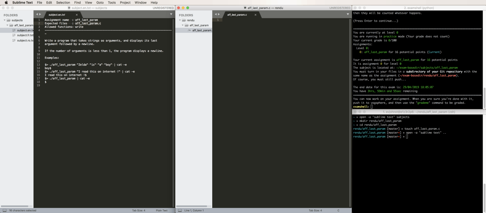

# Using Sublime Text on Exams

You may prefer Sublime Text over vim and emacs, and it's possible to use it during 42's exams! However, there's one important limitation: you shouldn't use the "Open File", "Save As", or, for unnamed files, "Save" dialogs. If you do, your computer will crash. Instead, open and save files as follows:

* Create files by entering `touch filename1 filename2 filename3` in your terminal
* Open files in Sublime Text by entering `open -a "sublime text" filename1 filename2 filename3` in your terminal
* Alternatively, enter `open -a "sublime text" .` to open a Sublime Text window with a file navigation sidebar with its root at the current directory
* Save changes to an existing file using ⌘S or File->Save as usual. Just make sure the file already exists, or the Save dialog box will pop up and crash your computer!

## Example

